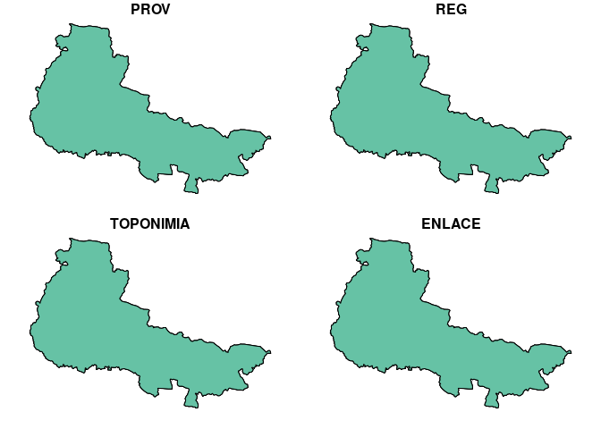
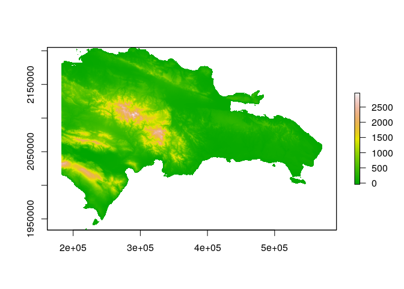
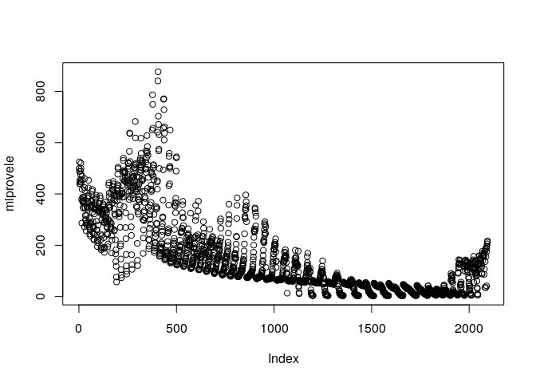
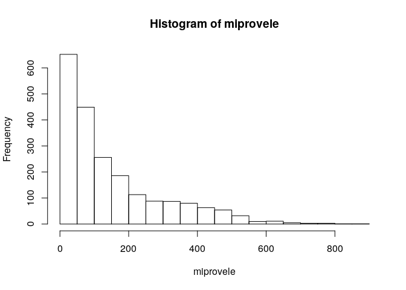

Unidad 1, asignación 2: exportar datos, leer ráster y extraer valores
=====================================================================

Sigo ayudando con `...`. Donde quiera que los veas, deberás sustituirlos por lo que indique el correspondiente mandato.

Dentro de las opciones de `knitr`, en el encabezado de este archivo, es probable que encuentres el argumento `eval = F`. Antes de tejer debes cambiarlo a `eval = T`, para que evalúe los bloques de código según tus cambios.

Provincia asignada
------------------

Toma nota del código de tu provincia asignada aleatoriamente.

``` r
 # abreviatura provaleatoria
 #       acade            11
 #       agrie            09
 #       aleir            10
 #       arqco            16
 #       cindy            12
 #       franc            23
 #       geora            08
 #       hoyod            22
 #       ingan            07
 #       ingdi            19
 #       itac9            15
 #       ivanv            25
 #       lbine            30
 #       leona            24
 #       magda            20
 #       maryj            02
 #       masue            26
 #       mmvol            13
 #       naui2            29
 #       rober            27
 #       wilne            06
 #       yoenn            21
```

Paquetes
--------

-   Carga el paquete `sf` y el paquete `raster`.

``` r
library(sf)
## Linking to GEOS 3.7.1, GDAL 2.4.2, PROJ 5.2.0
library(raster)
## Loading required package: sp
```

Exporta
-------

-   Determina el nombre de la capa provincias con `st_layers` del archivo GeoPackage que se encuentra en la carpeta `data`.

-   Carga la capa de provincias con la función `st_read`, asignándola al objeto `prov`.

-   Genera el objeto `miprov` que sólo contenga tu provincia.

-   Usando la función `st_write`, exporta el objeto `miprov` como GeoPackage a la carpeta `data` con el nombre `miprovexportado.gpkg`.

-   Lee el archivo exportado con la función `st_read` y asígnalo al objeto `miprovexportado`. Dado que sólo tiene una capa, no tienes que especificar el argumento `layer`.

-   Imprime en pantalla el objeto `miprovexportado` (sólo necesitas escribir el nombre del objeto).

``` r
st_layers('data/divisionRD.gpkg')
## Driver: GPKG 
## Available layers:
##      layer_name geometry_type features fields
## 1 PROVCenso2010       Polygon       32      4
## 2  MUNCenso2010       Polygon      155      5
## 3  REGCenso2010       Polygon       10      2
prov <- st_read(dsn = 'data/divisionRD.gpkg', layer = 'PROVCenso2010')
## Reading layer `PROVCenso2010' from data source `/home/wilne/unidad-1-asignacion-2-rasters-y-exportar-datos-espaciales-wilnellia/data/divisionRD.gpkg' using driver `GPKG'
## Simple feature collection with 32 features and 4 fields
## geometry type:  MULTIPOLYGON
## dimension:      XY
## bbox:           xmin: 182215.8 ymin: 1933532 xmax: 571365.3 ymax: 2205216
## epsg (SRID):    32619
## proj4string:    +proj=utm +zone=19 +datum=WGS84 +units=m +no_defs
miprov <- prov[prov$PROV %in% '06', ]
st_write(obj = miprov, dsn = 'data/miprovexportado.gpkg', driver = 'GPKG')
## Updating layer `miprovexportado' to data source `data/miprovexportado.gpkg' using driver `GPKG'
## Updating existing layer miprovexportado
## Writing 1 features with 4 fields and geometry type Multi Polygon.
miprovexportado <- st_read(dsn = 'data/miprovexportado.gpkg')
## Reading layer `miprovexportado' from data source `/home/wilne/unidad-1-asignacion-2-rasters-y-exportar-datos-espaciales-wilnellia/data/miprovexportado.gpkg' using driver `GPKG'
## Simple feature collection with 3 features and 4 fields
## geometry type:  MULTIPOLYGON
## dimension:      XY
## bbox:           xmin: 355925.3 ymin: 2105965 xmax: 431418.3 ymax: 2159142
## epsg (SRID):    32619
## proj4string:    +proj=utm +zone=19 +datum=WGS84 +units=m +no_defs
plot (miprovexportado)
```



Ráster
------

-   Con la función `raster`, carga el modelo digital de elevaciones que se encuentra en la carpeta `data`. Es el único archivo de extensión `.tif` Asígnalo al objeto `mde`

-   Genera un mapa con la función `plot`, usando la paleta de colores `terrain.colors`.

``` r
mde <- raster('data/mde_rd.tif')
plot(mde, col = terrain.colors(n = 255))
```



Extraer valores del ráster
--------------------------

-   Con la función `raster::extract`, extrae los valores de elevación correspondientes a tu provincia. Utiliza `mde` como objeto ráster y `miprov` como capa zonal. Asigna los valores al objeto `miprovele`.

-   Imprime en pantalla el objeto `miprovele` (sólo necesitas escribir el nombre del objeto).

-   Obtén los estadísticos descriptivos básicos (mínimo, primer cuartil, media, mediana, tercer cuartil, máximo) de `miprovele` con la función `summary`.

-   Genera un histograma de `miprovele` usando la función `hist`.

``` r
miprovele <- raster::extract(mde, miprov)[[1]]
plot (miprovele)
```



``` r
summary(miprovele)
##    Min. 1st Qu.  Median    Mean 3rd Qu.    Max. 
##    2.48   39.78   90.94  147.77  209.11  876.18
hist(miprovele)
```


